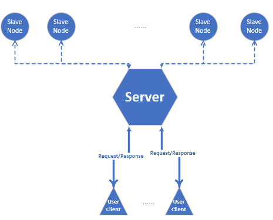

# distributed_file_processing_demo

Distributed file processing demo, using Linux C socket and GTK GUI\
This is a demo of distributed file processing system. In this demo, there is one server with multi salve node. Once a user client send a file processing request, the file will firstly be received by the server, and the server will distribute the task onto multi salve node to process. The server will wait on a thread for the finishing of all related salve nodes, and finally the result will be send back to the user client.\
In this project, user client GUI is based on GTK，the communication is realized with Linux C socket, and multi-threading is also used.\
The general structure is just the below picture shows.

